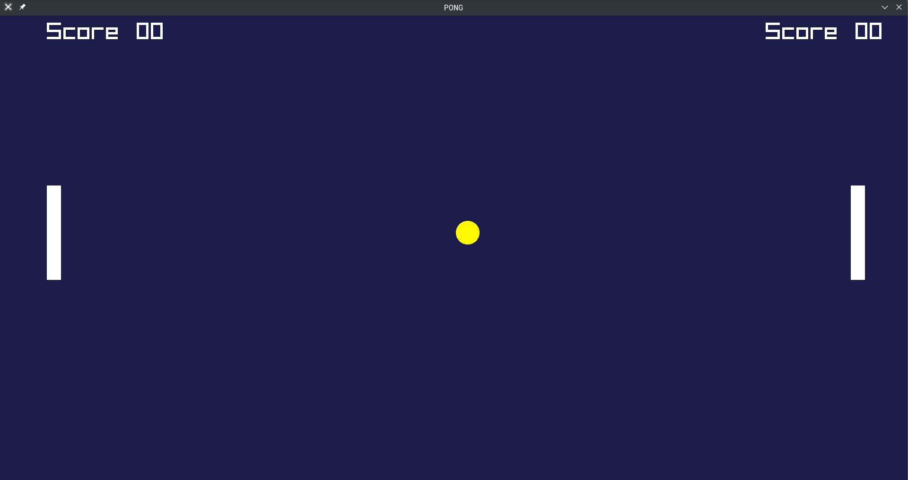

# Pong Game

This is a simple two-player Pong game implemented in C++ using the [raylib](https://www.raylib.com/) library.
The first player to reach 10 points wins the game.

## Features

* Two-player gameplay.
* Basic scorekeeping.
* Sound effects for paddle hits and losing the ball.

## Controls

### Player 1 (Left Paddle)

***W:** Move Up
***S:** Move Down

### Player 2 (Right Paddle)

***UP ARROW:** Move Up
***DOWN ARROW:** Move Down

> [!NOTE]
> Game works but not optimal or optimized .

## Screenshot

